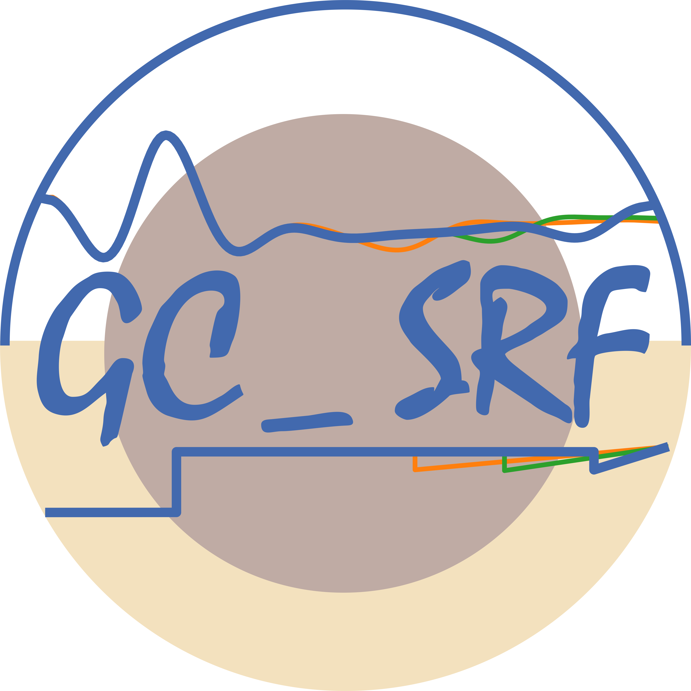

#   GCSRF_GIG_USTC-Training-Package   

[中文](#中文版本) | [English](#english-version)

---

## 中文版本

2023-地震学算法与程序培训班-S波接收函数提取策略GC_SRF相关文件   

### 文件树表 :

***1. SX_Deconv和GC_SRF程序及案例***
- Section001/  
    - README.md
    - src/
    - bin/
    - example01_kumar/
        - SX_Deconv_example_kumar.sh
        - calculate_test/
        - data/
        - figs/
    - example02_gcsrf/
        - GC_SRF_example_syn.sh
        - GC_SRF_plot.py
        - calculate_test/
        - data/
        - figs/
        - gcsrf_plot_subroutines.py   

***2.单台S波接收函数的RMSE排序和筛选脚本及案例***
- Section002/  
    - Plot_RMSE.sh
    - README.md
    - data/
        - CQ.ROC/
        - SC.MGU/
        - Do_RMSE.sh
        - fdd.lst
        - readsac.m
        - Silent_FiltRMSE.m
    - figs/
    - tmp/   

***3. 基于PSDM的S波接收函数的偏移成像python执行脚本及案例***
- Section003/  
    - README.md
    - example001_pyPSDM_runner_CDMOD.py
    - example002_pyPSDM_runner_IASP.py
    - data_gcsrf/
    - figs/
    - mod/
    - psdm/


### 使用方法 :

- 每个Section中分别的README.md文件中提供了具体依赖需求和案例操作流程,同行可以根据实际情况选择使用.
- 即便如此,仍然建议在Anaconda/Miniconda下安装大部分依赖程序,为方便各位使用,该部分将尽可能给出一个能够满足本程序包完整运行的最小的依赖安装方案.
- 设备中若已有conda+sac则大概率能完整运行.

**1. 安装 conda 和 SAC**
- **conda**安装包链接见[conda website](https://docs.conda.io/en/latest/miniconda.html)
    
- 例如,如果选择Miniconda3 Linux 64-bit平台,则参考如下命令安装
    ```
    wget https://repo.anaconda.com/miniconda/Miniconda3-latest-Linux-x86_64.sh
    bash Miniconda3-latest-Linux-x86_64.sh
    ```
    安装过程中全程使用默认选项即可,安装结束后需要初始化一下环境变量使conda生效,以bash脚本配置为例,参考如下命令初始化:
    ```
    source ~/.bashrc
    ```
    **SAC**的安装流程参考[SeismanBlog](https://seisman.github.io/SAC_Docs_zh/install/).

**2. 配置 conda 和 所需编译环境**
- **conda 方案一:**
1. 下载最新版本中根目录中提供的GCSRF.yml文件,在程序包根目录中进行环境配置.
2. 在conda中创建GCSRF环境并安装相应依赖:
    ```
    conda env create -f GCSRF.yml
    ```
3. 安装Taup:
    ```
    sudo apt-get install default-jdk
    sudo snap install taup
    ```

- **conda 方案二:**
1. 可在自己常用的conda环境中安装如下依赖:
    ```
    conda config --add channels conda-forge
    conda install obspy=1.4.0
    conda install pandas
    conda install octave -c conda-forge
    conda install gmt -c conda-forge
    ```
3. 安装Taup:
    ```
    sudo apt-get install default-jdk
    sudo snap install taup
    ```
- **编译环境:**
**若Section001/src/中编译顺利,请跳过阅读**
    除这些之外,还需检查gcc, gfortran, g++, mpich等编译器是否存在:
    ```
    g++ --version
    gcc --version
    gfortran --version
    mpic++ --version
    ```

    若命令不存在则需根据需要安装:
    - **> Ubuntu或其他基于Debian的Linux发行版:**
        打开终端并输入以下命令:
        ```
        sudo apt update
        sudo apt install gcc
        sudo apt install gfortran
        sudo apt install mpich
        ```
    - **> Fedora, CentOS, RHEL等基于RPM的Linux发行版:**

        打开终端并输入以下命令:
        ```
        sudo dnf install gcc
        sudo dnf install gfortran
        sudo dnf install mpich
        ```
    - **> macOS:**
        需安装Homebrew后使用brew命令安装:
        ```
        /bin/bash -c "$(curl -fsSL https://raw.githubusercontent.com/Homebrew/install/master/install.sh)"
        brew install gcc
        brew install gfortran
        brew install mpich
        ```  


### 常见问题 & 解决方案 2023-07-24

**I1:**

- ```编译时屏幕显示 sac_lpz.c: 492:2  for loop initial declaration are only allowed in C99 mode In function 'read_data_':``` 

**S1:**

- 可在Makefile 中为cpp文件的编译命令添加 -std=c99 **【Ubuntu测试无需,其他平台根据需要使用,最新Makefile中提供了这一选项】**

**I2:**

- ```example01_kumar.sh 运行时出现calculate文件夹不存在的提示```

**S2:**

- 脚本中已更改并加入文件夹判断,错误已更正. **【已修改】**

**I3:**

- ```GlibC和libstdc++版本问题可能导致在Redhat/CentOS平台编译失败```

**S3:**

- 对于Ubuntu/Debian平台,可以通过更新libc版本解决:

    ```
    sudo apt-get update
    sudo apt-get install libc6
    ```

**I4:**

- ```编译提示libgfortran.so.5找不到```

**S4:**
- 对于Ubuntu/Debian平台,可以通过安装libgfortran包解决:

    ```
    sudo apt-get update
    sudo apt-get install libgfortran5
    ```


**I5:**
- 该问题详见 [Closed Issue1](https://github.com/georom1996/GCSRF_GIG_USTC-Training-Package/issues/1)
    ```
    PSDM源代码中可能存在数组越界的问题:
    There might be a possible out-of-range of the array **inn1** in pierc_new_n.f: 297 line.
    ```

**S5:**

- 为避免出现数组越界问题,已对相应变量进行了初始化.**【已修改】**

**I6:**

- ```执行Section001中第一个例子时出现pssac WARNING,显示tmarker9没有定义```

**S6:**
- 原因在于shell中未能正确调用taup_setsac.若Taup是使用```sudo snap install taup```安装,则需确保java安装正常,若出现java库不存在的提示,可尝试通过```sudo apt-get install default-jdk```解决.

**I7:**

- ```在部分平台编译时需要指定gcc版本后才能编译,,f77可以替换成gfortran```

**S7:**

- 测试显示g++-11和g++-10均能编译通过 **【f77已替换为gfortran】**

**I8:**

- ```"omp.h" 找不到```

**S8:**

- 程序的早期版本使用过omp,当前版本未使用该库.**【已注释该行】**


### 参考文献 :
GC_SRF策略,请引用:   
- Zhang Z., & Deng Y. (2022). A Generalized Strategy From S‐Wave Receiver Functions Reveals Distinct Lateral Variations of Lithospheric Thickness in Southeastern Tibet. Geochemistry, Geophysics, Geosystems, 23(11). https://doi.org/10.1029/2022GC010619


脉冲反褶积计算,请附加引用:   
- Treitel, S., & Robinson, E. (1966). Seismic wave propagation in layered media in terms of communication theory. Geophysics, 31(1), 17– 32. https://doi.org/10.1190/1.1439729   
- Robinson, E., & Treitel, S. (1976). Net downgoing energy and resulting minimum-phase property of downgoing waves. Geophysics, 41(6), 1394– 1396. https://doi.org/10.1190/1.1440689   
- Robinson, E., & Treitel, S. (2000). Geophysical signal analysis. Society of Exploration Geophysicists. https://doi.org/10.1190/1.9781560802327   

PSDM成像,请附加引用:   

- Chen, L., Wen, L., & Zheng, T. (2005a). A wave equation migration method for receiver function imaging: 1. Theory. Journal of Geophysical Research, 110(B11). https://doi.org/10.1029/2005JB003665   
- Chen, L., Wen, L., & Zheng, T. (2005b). A wave equation migration method for receiver function imaging: 2. Application to the Japan subduction zone. Journal of Geophysical Research, 110(B11). https://doi.org/10.1029/2005JB003666   

### 致谢 :   
现有GC_SRF流程的相关功能实现均有赖于同行学者的慷慨分享与交流讨论.   

其中:   

- SX_Deconv和GC_SRF源码编写的早期工作得到了刘启民,徐强,Lupei Zhu等学者的帮助；   
- 接收函数基础以及QSEIS模型参数设置等方面得到了 LP Vinnik,Xiaohui Yuan 等学者的帮助,spmove.joe修改自Xiaohui Yuan教授程序；   
- 该工作的雏形也曾在2019年地震学算法与程序培训班(大理)上得到过陈凌研究员,吴庆举研究员,姚华建教授的当面指导；   
- QSEIS波形模拟程序来自 Rongjiang Wang 教授课题组;   
- PSDM相关程序来自于陈凌研究员课题组;   
- sacsnr、sacStack、sacio等均来自 Lupei Zhu 教授课题组； 
- 程序整理得到了 GIG Geophysics Lab - 724A 胡仲发、朱晟、黄润青、罗恒的帮助；
- 程序问题和解决方案部分得到了肖卓、韩如冰、苏文君柳、梁戌然、曾彦迪、闫晓东、寇华东等人的帮助.

在此一并表示感谢.


### 展望 :
- 当前版本基于实际工作流程进行整理,故暂未对脚本语言进行完全地统一,相关工作已在开展.   
- 目前各项功能函数均已在python环境中测试实现,更便于使用的新版本请关注后续PyGCSRF的上线.

---

## English Version

2023-Seismological Algorithm and Programming Training - GC_SRF S-wave Receiver Function Extraction Strategy Related Files   

### File Structure :

***1. SX_Deconv and GC_SRF Programs with Examples***
- Section001/  
    - README.md
    - src/
    - bin/
    - example01_kumar/
        - SX_Deconv_example_kumar.sh
        - calculate_test/
        - data/
        - figs/
    - example02_gcsrf/
        - GC_SRF_example_syn.sh
        - GC_SRF_plot.py
        - calculate_test/
        - data/
        - figs/
        - gcsrf_plot_subroutines.py   

***2. Single Station S-wave Receiver Function RMSE Sorting and Filtering Scripts with Examples***
- Section002/  
    - Plot_RMSE.sh
    - README.md
    - data/
        - CQ.ROC/
        - SC.MGU/
        - Do_RMSE.sh
        - fdd.lst
        - readsac.m
        - Silent_FiltRMSE.m
    - figs/
    - tmp/   

***3. PSDM-based S-wave Receiver Function Migration Imaging Python Scripts with Examples***
- Section003/  
    - README.md
    - example001_pyPSDM_runner_CDMOD.py
    - example002_pyPSDM_runner_IASP.py
    - data_gcsrf/
    - figs/
    - mod/
    - psdm/


### Usage Instructions :

- Each Section contains specific dependency requirements and case operation procedures in separate README.md files. Colleagues can choose to use them according to their actual situation.
- Nevertheless, it is still recommended to install most dependent programs under Anaconda/Miniconda. For the convenience of users, this section will provide a minimal dependency installation scheme that can satisfy the complete operation of this package as much as possible.
- If the device already has conda+sac, it can most likely run completely.

**1. Install conda and SAC**
- **conda** installation package link: [conda website](https://docs.conda.io/en/latest/miniconda.html)
    
- For example, if choosing Miniconda3 Linux 64-bit platform, refer to the following commands for installation:
    ```
    wget https://repo.anaconda.com/miniconda/Miniconda3-latest-Linux-x86_64.sh
    bash Miniconda3-latest-Linux-x86_64.sh
    ```
    Use default options throughout the installation process. After installation, initialize environment variables to make conda effective. For bash script configuration, refer to the following command for initialization:
    ```
    source ~/.bashrc
    ```
    **SAC** installation process reference: [SeismanBlog](https://seisman.github.io/SAC_Docs_zh/install/).

**2. Configure conda and Required Compilation Environment**
- **conda Option 1:**
1. Download the GCSRF.yml file provided in the root directory of the latest version, and configure the environment in the package root directory.
2. Create GCSRF environment in conda and install corresponding dependencies:
    ```
    conda env create -f GCSRF.yml
    ```
3. Install Taup:
    ```
    sudo apt-get install default-jdk
    sudo snap install taup
    ```

- **conda Option 2:**
1. Install the following dependencies in your commonly used conda environment:
    ```
    conda config --add channels conda-forge
    conda install obspy=1.4.0
    conda install pandas
    conda install octave -c conda-forge
    conda install gmt -c conda-forge
    ```
3. Install Taup:
    ```
    sudo apt-get install default-jdk
    sudo snap install taup
    ```
- **Compilation Environment:**
**If compilation in Section001/src/ is successful, please skip reading**
    In addition to these, you also need to check whether compilers such as gcc, gfortran, g++, mpich exist:
    ```
    g++ --version
    gcc --version
    gfortran --version
    mpic++ --version
    ```

    If commands do not exist, install as needed:
    - **> Ubuntu or other Debian-based Linux distributions:**
        Open terminal and enter the following commands:
        ```
        sudo apt update
        sudo apt install gcc
        sudo apt install gfortran
        sudo apt install mpich
        ```
    - **> Fedora, CentOS, RHEL and other RPM-based Linux distributions:**

        Open terminal and enter the following commands:
        ```
        sudo dnf install gcc
        sudo dnf install gfortran
        sudo dnf install mpich
        ```
    - **> macOS:**
        Need to install Homebrew and then use brew command to install:
        ```
        /bin/bash -c "$(curl -fsSL https://raw.githubusercontent.com/Homebrew/install/master/install.sh)"
        brew install gcc
        brew install gfortran
        brew install mpich
        ```  


### Common Issues & Solutions 2023-07-24

**I1:**

- ```Compilation screen shows sac_lpz.c: 492:2  for loop initial declaration are only allowed in C99 mode In function 'read_data_':``` 

**S1:**

- You can add -std=c99 to the cpp file compilation command in Makefile **【Ubuntu testing is not required, other platforms use as needed, the latest Makefile provides this option】**

**I2:**

- ```example01_kumar.sh shows calculate folder does not exist prompt when running```

**S2:**

- The script has been changed and folder judgment has been added, error has been corrected. **【Modified】**

**I3:**

- ```GlibC and libstdc++ version issues may cause compilation failure on Redhat/CentOS platforms```

**S3:**

- For Ubuntu/Debian platforms, it can be resolved by updating libc version:

    ```
    sudo apt-get update
    sudo apt-get install libc6
    ```

**I4:**

- ```Compilation prompts libgfortran.so.5 not found```

**S4:**
- For Ubuntu/Debian platforms, it can be resolved by installing libgfortran package:

    ```
    sudo apt-get update
    sudo apt-get install libgfortran5
    ```


**I5:**
- See details in [Closed Issue1](https://github.com/georom1996/GCSRF_GIG_USTC-Training-Package/issues/1)
    ```
    There might be a possible out-of-range of the array issue in PSDM source code:
    There might be a possible out-of-range of the array **inn1** in pierc_new_n.f: 297 line.
    ```

**S5:**

- To avoid array out-of-bounds issues, corresponding variables have been initialized. **【Modified】**

**I6:**

- ```When executing the first example in Section001, pssac WARNING appears, showing tmarker9 is not defined```

**S6:**
- The reason is that taup_setsac cannot be called correctly in shell. If Taup is installed using ```sudo snap install taup```, you need to ensure that java is installed normally. If java library does not exist prompt appears, you can try to solve it through ```sudo apt-get install default-jdk```.

**I7:**

- ```On some platforms, you need to specify gcc version before compiling, f77 can be replaced with gfortran```

**S7:**

- Testing shows that both g++-11 and g++-10 can compile successfully **【f77 has been replaced with gfortran】**

**I8:**

- ```"omp.h" not found```

**S8:**

- The early version of the program used omp, the current version does not use this library. **【This line has been commented out】**


### References :
For GC_SRF strategy, please cite:   
- Zhang Z., & Deng Y. (2022). A Generalized Strategy From S‐Wave Receiver Functions Reveals Distinct Lateral Variations of Lithospheric Thickness in Southeastern Tibet. Geochemistry, Geophysics, Geosystems, 23(11). https://doi.org/10.1029/2022GC010619


For spike deconvolution calculation, please additionally cite:   
- Treitel, S., & Robinson, E. (1966). Seismic wave propagation in layered media in terms of communication theory. Geophysics, 31(1), 17– 32. https://doi.org/10.1190/1.1439729   
- Robinson, E., & Treitel, S. (1976). Net downgoing energy and resulting minimum-phase property of downgoing waves. Geophysics, 41(6), 1394– 1396. https://doi.org/10.1190/1.1440689   
- Robinson, E., & Treitel, S. (2000). Geophysical signal analysis. Society of Exploration Geophysicists. https://doi.org/10.1190/1.9781560802327   

For PSDM imaging, please additionally cite:   

- Chen, L., Wen, L., & Zheng, T. (2005a). A wave equation migration method for receiver function imaging: 1. Theory. Journal of Geophysical Research, 110(B11). https://doi.org/10.1029/2005JB003665   
- Chen, L., Wen, L., & Zheng, T. (2005b). A wave equation migration method for receiver function imaging: 2. Application to the Japan subduction zone. Journal of Geophysical Research, 110(B11). https://doi.org/10.1029/2005JB003666   

### Acknowledgments :   
The implementation of the related functions of the existing GC_SRF process relies on the generous sharing and exchange discussions of fellow scholars.   

Among them:   

- The early work of SX_Deconv and GC_SRF source code writing was helped by scholars such as Qimin Liu, Xu Qiang, Lupei Zhu;   
- The receiver function foundation and QSEIS model parameter setting were helped by scholars such as LP Vinnik, Xiaohui Yuan, and spmove.joe was modified from Professor Xiaohui Yuan's program;   
- The prototype of this work was also guided face-to-face by Professor Chen Ling, Professor Wu Qingju, and Professor Yao Huajian at the 2019 Seismological Algorithm and Programming Training (Dali, Yunnan, China);   
- QSEIS waveform simulation program comes from Professor Rongjiang Wang's research group;   
- PSDM related programs come from Professor Chen Ling's research group;   
- sacsnr, sacStack, sacio, etc. all come from Professor Lupei Zhu's research group; 
- Program organization was helped by GIG Geophysics Lab - 724A Hu Zhongfa, Zhu Sheng, Huang Runqing, Luo Heng;
- The program issues and solutions section was helped by Professor Xiao Zhuo, Professor Han Rubing, Doctor Su Wenjunliu, Doctor Liang Xuran, Zeng Yandi, Yan Xiaodong, Kou Huadong and others.

Thanks to all of them.


### Prospects :
- The current version is organized based on actual workflow procedures, so the script language has not been completely unified, and related work is underway.   
- Currently, all functional functions have been tested and implemented in the python environment. Please pay attention to the upcoming PyGCSRF for a more user-friendly new version.

---

**声明 / Declaration:** 
本README文档的双语版本由Claude生成。  
The bilingual version of this README document was generated by Claude.
