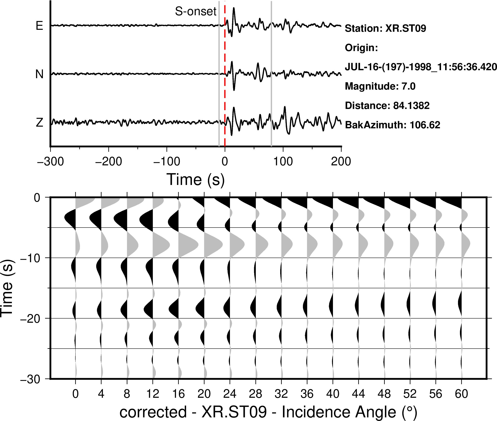
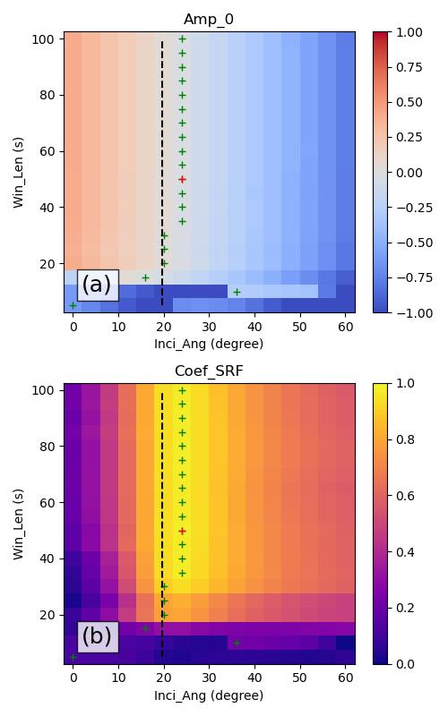
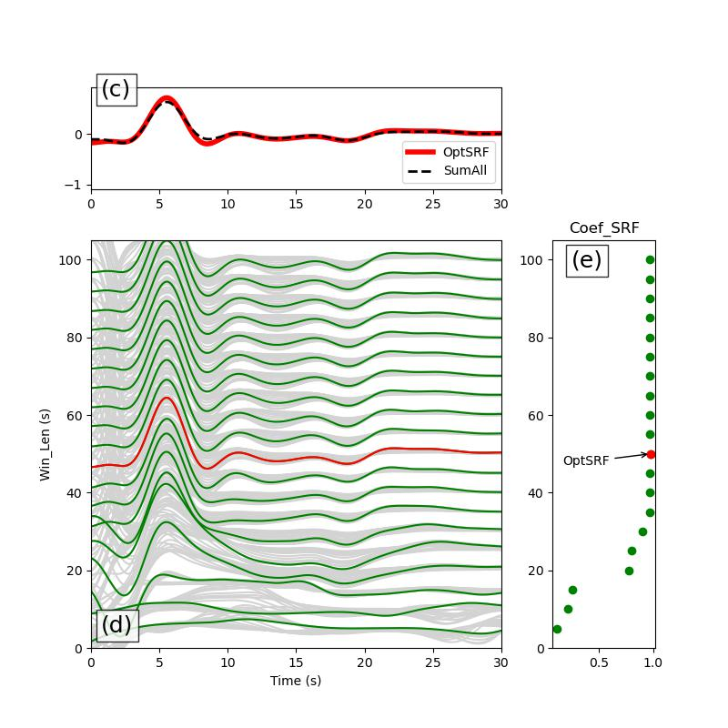

## 操作流程
- 进入src文件夹,编译相关源码
```bash
cd src
make clean
make all
cd ../
```   
- 进入example01_kumar文件夹,执行复现Kumar文章的案例
```bash
cd ./example01_kumar
bash ./SX_Deconv_example_kumar.sh
cd ../
```
结果放置于example01_kumar/figs文件夹中,图件如下：   


- 进入example02_gcsrf文件夹,执行GC_SRF计算S波接收函数的案例
```bash
cd ./example02_gcsrf
bash ./GC_SRF_example_syn.sh
```   
然后执行绘图命令
```bash
python ./GC_SRF_plot.py
```   
结果图件放置于example02_gcsrf/figs文件夹中,图件如下：   
   


## 文件说明
- 在流程操作编译完成之后,在bin文件夹中将出现如下命令：
    - 1. **SX_Deconv**
            该程序为脉冲反褶积计算的独立计算程序,使用方法为：
            ```bash
            SX_Deconv -Z Z.sac -N N.sac -E E.sac –inc 16 -t1 100 -t2 120 -D 
            ```
            程序选项：
            ```
                -t1 脉冲起始时刻 (相对SAC文件开始时刻的时间)
                -t2 脉冲结束时刻 (相对SAC文件开始时刻的时间)
                -inc 旋转角度
                -D 输出逆滤波器及波形旋转后的SAC文件
            ```   
            输入文件：
            ```
                Z.sac N.sac E.sac
                注:头端中需要确保baz存在
            ```
            输出文件：
            ```
            默认输出：
                rf.sl.sac : 未归一化的L分量反褶积波形(SRF)
                rf.sq.sac : 未归一化的Q分量反褶积波形
                rf.st.sac : 未归一化的T分量反褶积波形
                rf.nsl.sac : 振幅归一化的L分量反褶积波形(SRF)
                rf.nsq.sac : 振幅归一化的Q分量反褶积波形
                rf.nst.sac : 振幅归一化的T分量反褶积波形
            若使用-D选项，则会额外输出：
                l-com.sac : L分量原始波形
                q-com.sac : Q分量原始波形
                t-com.sac : T分量原始波形
                fil.sac : 反子波滤波器
            ```
    - 2. **GC_SRF**
            该程序为循环不同子波时窗长度和旋转角度循环计算反褶积的独立程序,
            程序使用方法为：
            ```bash
            GC_SRF -Z Z.sac -N N.sac -E E.sac -t1 t1
            ```
            程序选项：
            ```
                -t1 脉冲起始时刻 (相对SAC文件开始时刻的时间) 
                注:程序中默认循环 win_len=0:5:100; inci=0:4:60, 其中 t1 设定为直达 S 到时相对 SAC 文件起始时刻的时间, win_len 起算点为 t1-5s
            ```
            输入文件：
            ```
                Z.sac N.sac E.sac
                注:头端中需要确保baz存在
            ```
            输出文件：
            ```
            默认输出：
                ("rf-%02.f-%03.f.sl.sac", incnum, win_len) : 未归一化的L分量反褶积波形(SRF)
                ("rf-%02.f-%03.f.sl.sac", incnum, win_len) : 未归一化的Q分量反褶积波形
                ("rf-%02.f-%03.f.sl.sac", incnum, win_len) : 未归一化的T分量反褶积波形
                ("rf-%02.f-%03.f.nsl.sac", incnum, win_len) : 振幅归一化的L分量反褶积波形(SRF)
                ("rf-%02.f-%03.f.nsl.sac", incnum, win_len) : 振幅归一化的Q分量反褶积波形
                ("rf-%02.f-%03.f.nsl.sac", incnum, win_len) : 振幅归一化的T分量反褶积波形
            ```

            ```
    - 3. **GC_SRF_par**
            该程序为GC_SRF的并行版本,使用方法与GC_SRF相同,用于加快循环计算的效率：
            ```bash
            GC_SRF_par -Z Z.sac -N N.sac -E E.sac -t1 t1
            ```
            程序选项：
            ```
                -t1 脉冲起始时刻 (相对SAC文件开始时刻的时间)
                -D 输出逆滤波器及波形旋转后的SAC文件
            ```
    - 4. **GC_SRF_post**
            该程序为GC_SRF/GC_SRF_par的后处理程序,用于计算所有反褶积结果波形的0时刻振幅能量网格,互相关系数网格,：
            ```bash
            GC_SRF_post
            ```
            程序选项：
            ```
                无任何选项，直接在GC_SRF计算目录执行
            ```
            输入文件：
            ```
                GC_SRF/GC_SRF_par输出波形处理后的以nsl.sac.100.cutrv.rm.rv结尾的SAC格式数据文件

                注:该输入SAC格式数据文件获取方式为：
                1. 将GC_SRF/GC_SRF_par输出波形(nsl.sac结尾文件)截取-100s到100s(.100.cut);
                2. 翻转时间轴(.rv);
                3. moveout矫正(.rm);
                4. 翻转转时间轴(rv).
                具体操作脚本可参考Section001/example02_gcsrf/GC_SRF_example_syn.sh
            ```
            输出文件：
            ```
                all.Amp_0.xyz : 所有SRF的0时刻振幅谱
                all.Energy_0.xyz : 所有SRF的0时刻能量谱
                Min.lst : 不同时窗长度对应的0时刻振幅最低的波形列表，文件格式为：旋转角度,时窗长度,文件名
                all.CCC.xyz : 所有SRF的与均值波形的互相关系数谱
                SelectedRed.CC.lst : 不同时窗长度0时刻振幅最低的波形对应的互相关系数列表，文件格式为：旋转角度,时窗长度,文件名
                OptimalSRF.lst : 最佳SRF,文件格式为：文件名,旋转角度,时窗长度,互相关系数
            ```

    - 5. spmove.joe
            ```
                修改自Xiaohui Yuan教授spmout代码
            ```
    - 6. sacsnr 和 sacStack
        来自[SACTOOLS](https://github.com/msthorne/SACTOOLS/tree/master).


## 必要工具和库
### Linux
1. Taup
2. GMT 6
3. SAC
4. MPIC++
5. GCC

### Python Lib
1. obspy 
2. pandas 
3. numpy 
4. matplotlib

