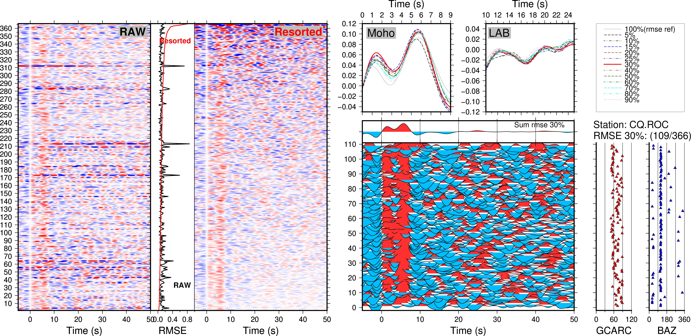
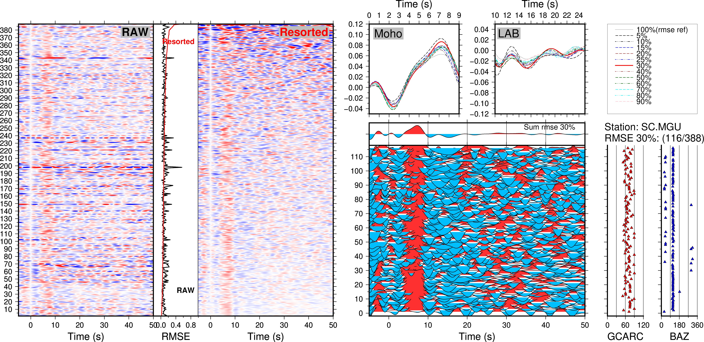

## 单台S波接收函数的RMSE排序


## RMSE排序的操作流程
### 1. RMSE分析
- 进入Section002/data/文件夹中,对单台数据进行RMSE排序操作,linux执行命令
```bash
cd ./data/
bash Do_RMSE.sh
cd ../
```
### Do_RMSE.sh脚本说明
功能: 对GC_SRF流程计算结果进行预处理,并开展RMSE分析

**输入数据 :**
[ 以CQ.ROC台站为例 ]
```
/data/CQ.ROC/Good.srf.l.*sac.100.cut.rm : 台站CQ.ROC使用GC_SRF提取得到单台多事件SRF经过时窗截取(-100s~100s)、时序翻转、moveout校正后的SAC波形
```
**输出文件:**
输出文件主要用于绘图展示.
```
/data/CQ.ROC/*srf : 输入SAC数据经过再次时序翻转和时窗截取(-5s~95s),该文件可与常规的P波接收函数波形进行直接对比.
CQ.ROC.ref_sum.xy :  不同SRF叠加比例对应的叠加波形 
CQ.ROCSRF_before.xyz : RMSE排序前SRF xyz网格文件,格式:时间,波形序号,波形振幅
CQ.ROCSRF_after.xyz : RMSE排序后SRF xyz网格文件,格式:时间,波形序号,波形振幅
CQ.ROCrmse_before.xy : 排序前随波形序号排列的RMSE值
CQ.ROCrmse_after.xy : 排序后随波形序号排列的RMSE值 
```

**PS:** 该脚本中使用了octave的静默运行,需提前安装,如果已使用GCSRF.yml创建conda环境则无需额外安装.

Ubuntu/WSL平台安装命令为```sudo apt install octave-signal```  
Anaconda/miniconda平台安装命令为```conda install -c conda-forge octave ```  
macOS Homebrew安装命令为```brew install octave```  
macOS App Bundles安装包见 https://github.com/octave-app/octave-app/releases

### 2. RMSE分析结果绘图
- 在Section002文件夹中,linux执行命令   
```bash
bash ./Plot_RMSE.sh CQ.ROC
```
结果图件放置于figs文件夹中,图件如下:   
     

- 在Section002文件夹中,linux执行命令   
```bash
bash ./Plot_RMSE.sh SC.MGU
```
结果图件放置于figs文件夹中,图件如下:
   

## 必要工具和库
### Linux
1. GMT 6
2. SAC
3. Taup
4. octave