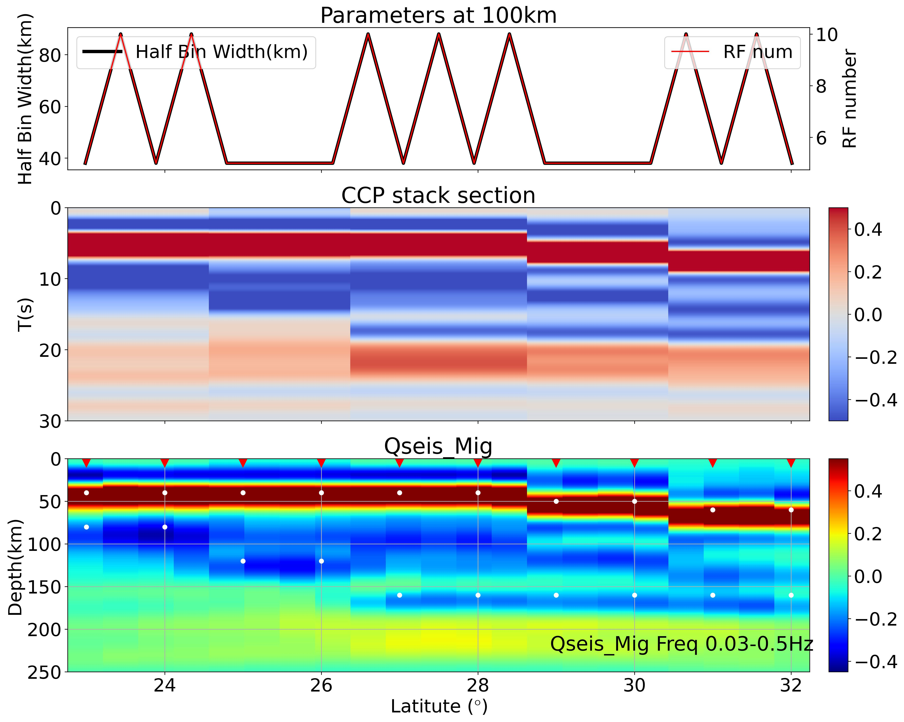
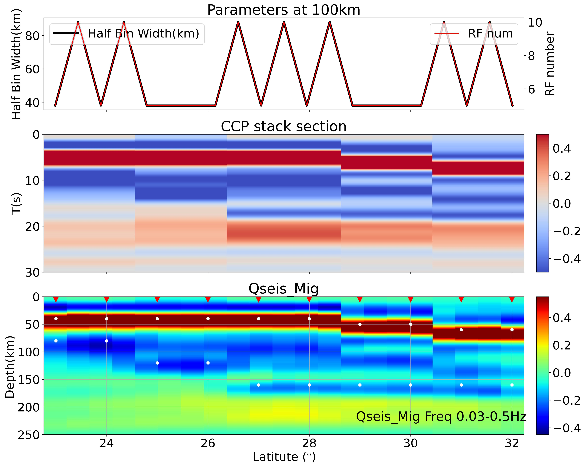

## Section003 多台S波接收函数的PSDM偏移成像


### 脚本说明
**功能:**
- 以陈凌老师课题组PSDM程序包为基础构建的python Runner,在该Runner脚本中相应参数设置与PSDM程序包一致.参数设置部分由"# [Parameters Part Begin]"和"# [Parameters Part End]"字段标识.

### 偏移成像操作流程
- 在Section003文件夹中，linux执行命令   
```bash
python example001_pyPSDM_runner_CDMOD.py
```
结果图件放置于figs文件夹中，图件如下:   
  

- 在Section003文件夹中，linux执行命令   
```bash
python example002_pyPSDM_runner_IASP.py
```
结果图件放置于figs文件夹中，图件如下:   
    

## 必要工具和库
### Linux
1. SAC   
### Python
1. obspy
2. numpy 
3. pandas
4. scipy 
5. matplotlib